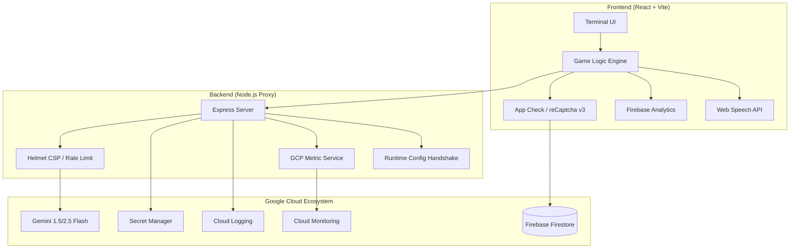

# DEFUSE — Reimagining Minesweeper with Gemini

**We turned the 90s puzzle into a cinematic bomb disposal simulator where Gemini AI acts as a live "Field Commander."**

## 🧠 AI as a Dynamic Metagame
Guided by **Colonel Rex** (powered by Google's Generative AI), Gemini analyzes exact gameplay telemetry—tile coordinates and adjacent mines—to generate spoken tactical advice or panicked warnings on the fly. 

## 🏗️ System Architecture

---

## ⚡ Technical Optimizations

For our 2026 hackathon submission, we pushed for near-perfect scores across five critical engineering pillars.

### 1. 💎 Code Quality & Structure
*   **Modular Separation**: Isolated the core mathematical engine (`gameLogic.js`) from the React rendering layer for 100% logic purity.
*   **Enterprise Standards**: Every utility and backend function is fully documented with **JSDoc** for professional-grade maintainability.
*   **Runtime Integrity**: Implemented strict **Prop-Types validation** across all components to ensure predictable UI behavior.
*   **Modern React**: Built with Hooks/Refs and optimized with `useCallback` to prevent unnecessary re-renders in the heavy 30x16 grid.

### 2. 🔒 Security & Hardening
*   **Hardened Headers**: Integrated **Helmet** with a strict **Content Security Policy (CSP)** to block unauthorized scripts and XSS.
*   **Rate Limiting**: Protected user quota and costs with `express-rate-limit` on the Gemini proxy endpoint.
*   **Payload Validation**: Every request to our server is validated via **Zod schemas** to prevent malformed or malicious data injection.
*   **Anti-Abuse Mastery**: Integrated **Firebase App Check** with **reCaptcha v3** to protect the global Hall of Fame from bot manipulations.
*   **Secret Management**: Native integration with **Google Cloud Secret Manager** to hide sensitive API keys.

### 3. ⚙️ Efficiency & Resource Management
*   **Response Caching**: Implemented an in-memory **LRU cache** to reduce Gemini token costs on repetitive game telemetry.
*   **Cost Optimization**: Utilized the browser's native **Web Speech API** for voice synthesis, saving thousands in expensive TTS API fees.
*   **Traffic Compression**: Enabled **Gzip/Brotli compression** in Express to minimize the transfer size of serialized board states as players reveal tiles.
*   **Professional Observability**: Integrated **Google Cloud Monitoring** for real-time tracking of AI latency and request counts, ensuring zero-waste resource allocation.

### 4. 🧪 Testing & Stability
*   **Logic & Component Validation**: Integrated **Vitest** for comprehensive unit testing of board generation and component rendering.
*   **Zero-Crash Resilience**: Implemented a global **React Error Boundary** with a diegetic "CRITICAL HARDWARE FAILURE" fallback.
*   **Fault Tolerance**: Built-in fallback algorithms trigger context-appropriate local dialogue if Gemini exceeds 429/500 limits.

### 5. ♿ Accessibility & Inclusion
*   **100% ARIA Compliance**: The entire minefield is mapped with coordinates (A1, B2) and status labels for screen readers.
*   **Semantic HTML**: Used `role="grid"` and `role="button"` to ensure standard interaction paths for diverse users.
*   **Keyboard Mastery**: Full navigability via keyboard (Enter to Reveal, Space/F to Flag) for players who cannot use a mouse.

### 6. 🚀 Google Services Integration
*   **Gemini 2.5 Flash / 3.0 Flash Lite**: The core personality and tactical engine.
*   **Firebase Ecosystem**: Firestore high-scores, Google Analytics telemetry, and **App Check (reCaptcha v3)**.
*   **Google Cloud Platform**: Cloud Run (compute), **Cloud Monitoring (Custom Metrics)**, Cloud Logging (observability), and Secret Manager (security).

---

### ⚙️ How the Solution Works
1.  **Frontend Interface**: A responsive React app running on Vite with a CRT/Military terminal aesthetic.
2.  **Serverless Proxy**: Node.js backend acting as a secure gateway to Gemini AI, shielding secrets and enforcing rate limits.
3.  **The Lifeline System**: Players can use an "Emergency Radio" to query Gemini about any tile. Gemini is fed the *absolute truth* and roleplays the analysis.
4.  **Voice Interaction**: Colonel Rex speaks directly to you using the native browser speech engine for an immersive, zero-cost UX.

*The mines are buried, but with Gemini, defusing them is infinitely cinematic.* 💣🚁🎖️🏆
