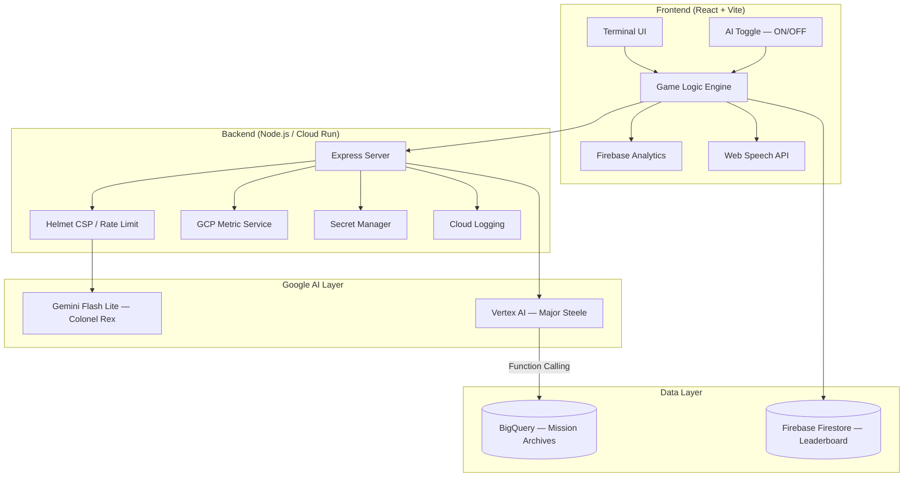

# DEFUSE — Reimagining Minesweeper with Dual AI

**A cinematic bomb disposal simulator where two AI systems watch over every mission — Colonel Rex calls real-time tactics, Major Steele debriefs with data.**

---

## 🧠 Dual-AI Architecture

### Colonel Rex (Tactical — `@google/generative-ai`)
Powered by **Gemini 2.5 Flash Lite** via the Google Generative AI SDK. Generates real-time, personality-driven commentary on every tile reveal, flagging high-danger zones and celebrating near-misses — with zero latency because it runs async. Players control usage with an **AI ON / AI OFF toggle** that preserves API quota and degrades gracefully to personality-matched fallback dialogue.

### Major Steele (Strategic — `@google-cloud/vertexai`)
Powered by **Vertex AI Gemini 2.5 Flash Lite** with **function calling**. Fires after every game end (victory or loss) to pull mission archive data from **BigQuery** and generate a data-grounded Strategic Debrief embedded directly in the victory/game-over overlay. Uses **Application Default Credentials (ADC)** — no API key required in Cloud Run.

---

## 🏗️ System Architecture



---

## ⚡ What Changed in the Final Submission

### 🤖 AI Upgrade — From Broken to Production
- **Removed `@google/adk`** — the ADK agent never reached production (500 errors, no IAM, premature library). Replaced with a clean direct Vertex AI SDK implementation.
- **Removed the "Command Center"** screen — the standalone ADK chat UI was cut. The debrief is now embedded directly in the post-game overlays, making it part of the natural game flow.
- **Fixed BigQuery retrieval** — added `ensureArchivesExist()` that self-heals the dataset and table on first run. Previously the query failed silently when the table didn't exist.
- **Vertex AI Function Calling** — `getStrategicDebrief()` follows the correct two-turn pattern: model requests `query_mission_history` → backend executes BigQuery → model receives results → generates grounded debrief.

### 💡 AI Assist Toggle
Added a **`● AI ON / ○ AI OFF`** toggle button in the Colonel Rex panel header.
- When OFF, Rex responds with personality-matched static dialogue - zero API cost, zero latency
- Switching logs a system message in the Rex feed confirming the state change

---

## 🚀 Google Services Integration

| Service | SDK / Tool | Role |
|---|---|---|
| **Gemini Flash Lite** | `@google/generative-ai` | Colonel Rex — real-time tile commentary |
| **Vertex AI** | `@google-cloud/vertexai` | Major Steele — strategic post-game debrief |
| **BigQuery** | `@google-cloud/bigquery` | Mission archive — queried by Vertex AI via function calling |
| **Cloud Monitoring** | `@google-cloud/monitoring` | Custom metrics: `mission_archived`, `vertex_debrief_requests` |
| **Cloud Logging** | `@google-cloud/logging` | Structured request and error logs |
| **Secret Manager** | `@google-cloud/secret-manager` | Secure `GEMINI_API_KEY` retrieval on Cloud Run |
| **Cloud Run** | GCP | Containerized Node.js backend |
| **Firebase Firestore** | Firebase SDK | Global leaderboard |
| **Firebase Analytics** | Firebase SDK | Game event telemetry |
| **Firebase AppCheck** | Firebase SDK | Anti-abuse on leaderboard writes |

---

## ⚙️ How It Works End-to-End

1. **Game Start** — React app loads with AI assist OFF. Player clicks the `● AI ON` button to enable Gemini commentary.
2. **Every Tile Reveal** — if AI is ON, Rex calls Gemini with tile coordinates + adjacency context. If OFF, instant fallback dialogue fires.
3. **Emergency Radio (Lifeline)** — player can query Rex once per game for targeted intel on any tile coordinate.
4. **Game Ends** — the backend fires two concurrent calls:
   - `/api/archive` → inserts mission row into BigQuery
   - `/api/agent/debrief` → Vertex AI calls `query_mission_history` (BigQuery), receives stats, generates 3–4 sentence data-grounded debrief
5. **Overlay** — both Victory and Game Over screens render the debrief with a "Analyzing mission archives..." skeleton while Vertex AI responds.

---

## 🔐 Security

- **Helmet.js** with strict `Content-Security-Policy`
- **Rate limiting** on all `/api/` routes
- **Secret Manager** for key management — no keys in source or image
- **ADC** for Vertex AI / BigQuery — service-to-service, zero keys
- **Firebase App Check (reCaptcha v3)** — anti-abuse on leaderboard writes

---

## 🛠️ Local Development

```bash
npm install
cp .env.example .env   # add GEMINI_API_KEY
npm run dev            # Vite frontend on :5173
node server.js         # Express backend on :3000
```

## 🐳 Docker / Cloud Run

```bash
docker build -t defuse-ai .
docker run -p 8080:8080 \
  -e GEMINI_API_KEY=your_key \
  -e GOOGLE_CLOUD_PROJECT=your_project \
  defuse-ai
```

*The mines are buried. With Gemini, defusing them is cinematic.* 💣🎖️
